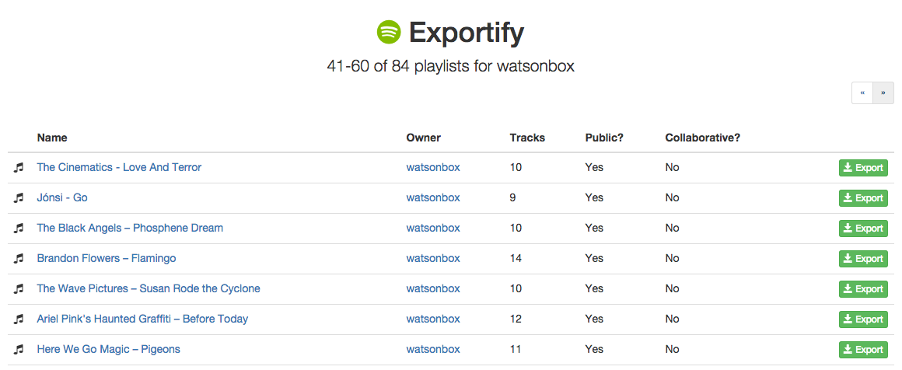

Export your Spotify playlists to [CSV](https://en.wikipedia.org/wiki/Comma-separated_values) by clicking on the link below:

[https://watsonbox.github.io/exportify/](https://watsonbox.github.io/exportify/)

As many users have noted, there is no way to export/archive/backup playlists from the Spotify client for safekeeping. This application provides a simple interface for doing that using the [Spotify Web API](https://developer.spotify.com/documentation/web-api/).

**No data will be saved - the entire application runs in the browser.**

## Usage

1. Fire up [the app](https://watsonbox.github.io/exportify/)
2. Click 'Get Started'
3. Grant Exportify read-only access to your playlists
4. Click the 'Export' button to export a playlist

Click 'Export All' to save a zip file containing a CSV file for each playlist in your account. This may take a while when many playlists exist and/or they are large.

### Re-importing Playlists

Once playlists are saved, it's also pretty straightforward to re-import them into Spotify. Open up the CSV file in Excel, for example, select and copy the `spotify:track:xxx` URIs, then simply create a playlist in Spotify and paste them in. This has only been tested with the desktop app.

### Export Format

Track data is exported in [CSV](http://en.wikipedia.org/wiki/Comma-separated_values) format with the following fields from the [Spotify track object](https://developer.spotify.com/documentation/web-api/reference/tracks/get-several-tracks/):

- Track URI
- Track Name
- Artist URI(s)
- Artist Name(s)
- Album URI
- Album Name
- Album Artist URI(s)
- Album Artist Name(s)
- Album Release Date
- Album Image URL (typically 640x640px jpeg)
- Disc Number
- Track Number
- Track Duration (ms)
- Track Preview URL (mp3)
- Explicit?
- Popularity
- ISRC ([International Standard Recording Code](https://isrc.ifpi.org/en/))
- Added By
- Added At

By clicking on the cog, additional data can be exported.

By selecting "Include artists data", the following fields will be added from the [Spotify artist object](https://developer.spotify.com/documentation/web-api/reference/artists/get-several-artists/):

- Artist Genres

And by selecting "Include audio features data", the following fields will be added from the [Spotify audio features object](https://developer.spotify.com/documentation/web-api/reference/tracks/get-several-audio-features/):

- Danceability
- Energy
- Key
- Loudness
- Mode
- Speechiness
- Acousticness
- Instrumentalness
- Liveness
- Valence
- Tempo
- Time Signature

Additionally, by selecting "Include album data", the following fields will be added from the [Spotify album object (full)](https://developer.spotify.com/documentation/web-api/reference/object-model/#album-object-full)

- Album Genres
- Label
- Copyrights

Note that the more data being exported, the longer the export will take.

### Playlist Search

If you're searching for a specific playlist to export, you can use the search facility to find it quickly by name:

Please be aware that if you have a very large number of playlists, there may be a small delay before the first search results appear since the Spotify API itself doesn't allow for searching directly, so all playlists are retrieved first.

Searching is _case-insensitive_.

## Development

This project was bootstrapped with [Create React App](https://github.com/facebook/create-react-app).

In the project directory, first run `yarn install` to set up dependencies, then you can run:

**`yarn start`**

Runs the app in the development mode.\
Open [http://localhost:3000](http://localhost:3000) to view it in the browser.

The page will reload if you make edits.\
You will also see any lint errors in the console.

**`yarn test`**

Launches the test runner in the interactive watch mode.\
See the section about [running tests](https://facebook.github.io/create-react-app/docs/running-tests) for more information.

**`yarn build`**

Builds the app for production to the `build` folder.

### Stack

In addition to [Create React App](https://github.com/facebook/create-react-app), the application is built using the following tools/libraries:

* [React](https://reactjs.org/) - A JavaScript library for building user interfaces
* [Bootstrap 4](https://getbootstrap.com/) - styling and UI components
* [Font Awesome 5](https://fontawesome.com/) - vector icon set and toolkit
* [React Testing Library](https://testing-library.com/docs/react-testing-library/intro/) - light-weight solution for testing React DOM nodes
* [MSW](https://mswjs.io/) - network-level request mocking (more of my own thoughts [here](https://watsonbox.github.io/posts/2020/11/30/discovering-msw.html))

## Notes

- According to Spotify's [documentation](https://developer.spotify.com/web-api/working-with-playlists/):

  > Folders are not returned through the Web API at the moment, nor can be created using it".

  Unfortunately that's just how it is.

- I've [gone to some lengths](https://github.com/watsonbox/exportify/pull/75) to try to eliminate errors resulting from excessively high usage of the Spotify API. Nonetheless, exporting data in bulk is a fairly request-intensive process, so please do try to use this tool responsibly. If you do require more throughput, please consider [creating your own Spotify application](https://github.com/watsonbox/exportify/issues/6#issuecomment-110793132) which you can use with Exportify directly.

- Disclaimer: It should be clear, but this project is not affiliated with Spotify in any way. It's just an app using their API like any other, with a cheeky name and logo 😇.

- In case you don't see the playlists you were expecting to see and realize you've accidentally deleted them, it's actually possible to [recover them](https://support.spotify.com/us/article/can-i-recover-a-deleted-playlist/).

## Error Monitoring

Error monitoring provided by Bugsnag.

## Contributing

1. Fork it ( https://github.com/watsonbox/exportify/fork )
2. Create your feature branch (`git checkout -b my-new-feature`)
3. Commit your changes (`git commit -am 'Add some feature'`)
4. Push to the branch (`git push origin my-new-feature`)
5. Create a new Pull Request
